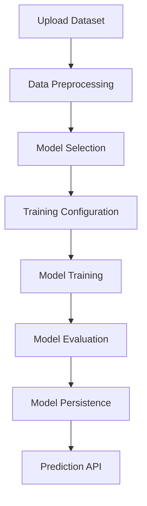

# 🧠 Neural Networks Module Documentation

Documentación completa del módulo de redes neuronales para la plataforma de análisis de datos.

## 📋 Tabla de Contenidos

- [Instalación](#instalación)
- [Arquitectura](#arquitectura)
- [Endpoints API](#endpoints-api)
- [Modelos Soportados](#modelos-soportados)
- [Ejemplos de Uso](#ejemplos-de-uso)
- [Configuración Avanzada](#configuración-avanzada)
- [Troubleshooting](#troubleshooting)

## 🔧 Instalación

### Dependencias Principales

```bash
# Core ML libraries
pip install tensorflow>=2.13.0
pip install torch>=2.0.0
pip install scikit-learn>=1.3.0

# Time series
pip install darts>=0.25.0

# Visualization
pip install matplotlib>=3.7.0
pip install seaborn>=0.12.0
pip install plotly>=5.15.0

# Model interpretation
pip install shap>=0.42.0
```

### Verificar Instalación

```python
# Test script
import tensorflow as tf
import torch
from darts import TimeSeries
print("✅ All ML libraries installed successfully!")
```

## 🏗️ Arquitectura

```
neural_networks/
├── 📁 routers/
│   └── neural_networks.py     # FastAPI endpoints
├── 📁 services/
│   └── neural_networks.py     # Core ML logic
├── 📁 schemas/
│   └── neural_networks.py     # Pydantic models
└── 📁 models/                 # Saved ML models
    ├── classification/
    ├── regression/
    └── timeseries/
```

### Flujo de Procesamiento



## 🔌 Endpoints API

### 1. Entrenamiento de Modelos

#### 🎯 Clasificación
```http
POST /neural-networks/classification/train
Content-Type: application/json

{
  "dataset_id": 1,
  "target_column": "species",
  "feature_columns": ["sepal_length", "sepal_width"],
  "test_size": 0.2,
  "epochs": 100,
  "batch_size": 32,
  "learning_rate": 0.001,
  "hidden_layers": [128, 64, 32],
  "dropout_rate": 0.2,
  "validation_split": 0.2
}
```

**Respuesta:**
```json
{
  "model_id": "uuid-string",
  "status": "success",
  "message": "Modelo entrenado exitosamente",
  "training_time": 45.2,
  "metrics": {
    "accuracy": 0.95,
    "precision": 0.94,
    "recall": 0.96,
    "f1_score": 0.95
  },
  "model_info": {
    "model_type": "classification",
    "n_classes": 3,
    "feature_count": 4,
    "architecture": [128, 64, 32]
  }
}
```

#### 📈 Regresión
```http
POST /neural-networks/regression/train
Content-Type: application/json

{
  "dataset_id": 2,
  "target_column": "price",
  "epochs": 150,
  "hidden_layers": [256, 128, 64],
  "learning_rate": 0.0005
}
```

**Respuesta:**
```json
{
  "model_id": "uuid-string",
  "status": "success",
  "metrics": {
    "mse": 0.045,
    "mae": 0.156,
    "r2_score": 0.89
  }
}
```

#### 📅 Series Temporales
```http
POST /neural-networks/timeseries/train
Content-Type: application/json

{
  "dataset_id": 3,
  "target_column": "sales",
  "date_column": "date",
  "model_type": "LSTM",
  "input_chunk_length": 12,
  "output_chunk_length": 1,
  "n_epochs": 200,
  "batch_size": 32,
  "learning_rate": 0.001,
  "hidden_size": 64,
  "num_layers": 2,
  "dropout": 0.1
}
```

### 2. Gestión de Modelos

#### Listar Modelos
```http
GET /neural-networks/models
```

**Respuesta:**
```json
[
  {
    "model_id": "uuid-1",
    "model_type": "classification",
    "name": "classification_uuid-1",
    "created_at": "2024-01-15T10:30:00Z",
    "target_column": "species",
    "metrics": {
      "accuracy": 0.95
    },
    "status": "trained"
  }
]
```

#### Eliminar Modelo
```http
DELETE /neural-networks/models/{model_id}
```

### 3. Predicciones

```http
POST /neural-networks/predict/{model_id}
Content-Type: application/json

{
  "sepal_length": 5.1,
  "sepal_width": 3.5,
  "petal_length": 1.4,
  "petal_width": 0.2
}
```

**Respuesta:**
```json
{
  "prediction": "setosa",
  "probability": {
    "setosa": 0.95,
    "versicolor": 0.03,
    "virginica": 0.02
  },
  "confidence": 0.95,
  "model_id": "uuid-string",
  "timestamp": "2024-01-15T10:30:00Z"
}
```

## 🤖 Modelos Soportados

### Clasificación & Regresión (TensorFlow/Keras)
- **Dense Neural Networks** con capas configurables
- **Dropout** para regularización
- **Optimizador Adam** con learning rate ajustable
- **Early Stopping** automático

### Series Temporales (Darts)
- **LSTM** - Long Short-Term Memory
- **GRU** - Gated Recurrent Unit
- **N-BEATS** - Neural Basis Expansion Analysis
- **NHiTS** - Neural Hierarchical Interpolation for Time Series
- **TCN** - Temporal Convolutional Network
- **Transformer** - Attention-based models

## 💡 Ejemplos de Uso

### Ejemplo 1: Clasificación de Iris
```python
import requests

# Datos de entrenamiento
train_request = {
    "dataset_id": 1,
    "target_column": "species",
    "epochs": 100,
    "hidden_layers": [64, 32, 16]
}

response = requests.post(
    "http://localhost:8000/neural-networks/classification/train",
    json=train_request
)

model_id = response.json()["model_id"]

# Predicción
predict_request = {
    "sepal_length": 5.1,
    "sepal_width": 3.5,
    "petal_length": 1.4,
    "petal_width": 0.2
}

prediction = requests.post(
    f"http://localhost:8000/neural-networks/predict/{model_id}",
    json=predict_request
)

print(prediction.json())
```

### Ejemplo 2: Series Temporales con LSTM
```python
# Entrenamiento de modelo LSTM
timeseries_request = {
    "dataset_id": 3,
    "target_column": "sales",
    "date_column": "date",
    "model_type": "LSTM",
    "input_chunk_length": 24,  # 24 meses históricos
    "output_chunk_length": 6,  # Predecir 6 meses
    "n_epochs": 100,
    "hidden_size": 128
}

response = requests.post(
    "http://localhost:8000/neural-networks/timeseries/train",
    json=timeseries_request
)
```

## ⚙️ Configuración Avanzada

### Hiperparámetros de Clasificación/Regresión

| Parámetro | Descripción | Rango | Default |
|-----------|-------------|-------|---------|
| `epochs` | Número de iteraciones | 10-1000 | 100 |
| `batch_size` | Tamaño del lote | 8-512 | 32 |
| `learning_rate` | Tasa de aprendizaje | 0.0001-0.1 | 0.001 |
| `hidden_layers` | Neuronas por capa | [16-512] | [128,64,32] |
| `dropout_rate` | Tasa de dropout | 0.0-0.8 | 0.2 |
| `validation_split` | División validación | 0.1-0.3 | 0.2 |

### Hiperparámetros de Series Temporales

| Parámetro | Descripción | Rango | Default |
|-----------|-------------|-------|---------|
| `input_chunk_length` | Ventana histórica | 1-100 | 12 |
| `output_chunk_length` | Horizonte predicción | 1-50 | 1 |
| `hidden_size` | Tamaño capa oculta | 16-512 | 64 |
| `num_layers` | Número de capas RNN | 1-5 | 2 |
| `dropout` | Dropout RNN | 0.0-0.5 | 0.1 |

## 🔍 Métricas de Evaluación

### Clasificación
- **Accuracy**: Precisión general
- **Precision**: Precisión por clase
- **Recall**: Sensibilidad por clase
- **F1-Score**: Media armónica precision/recall
- **Confusion Matrix**: Matriz de confusión

### Regresión
- **MSE**: Error cuadrático medio
- **MAE**: Error absoluto medio
- **R²**: Coeficiente de determinación
- **RMSE**: Raíz del error cuadrático medio

### Series Temporales
- **MAPE**: Error porcentual absoluto medio
- **SMAPE**: Error porcentual absoluto simétrico
- **MAE**: Error absoluto medio temporal

## 🐛 Troubleshooting

### Error: "TensorFlow no está disponible"
```bash
pip install tensorflow>=2.13.0
# o para GPU:
pip install tensorflow[and-cuda]>=2.13.0
```

### Error: "Darts no está disponible"
```bash
pip install darts>=0.25.0
# Con dependencias completas:
pip install "darts[all]"
```

### Error: "Dataset no encontrado"
- Verificar que el `dataset_id` existe en la base de datos
- Usar endpoint `GET /datasets/` para listar datasets disponibles

### Error: "Columna objetivo no encontrada"
- Verificar que `target_column` existe en el dataset
- Revisar nombres exactos con `GET /datasets/{id}/preview`

### Error: "Memoria insuficiente"
- Reducir `batch_size` (ej: 16 en lugar de 32)
- Reducir tamaño de `hidden_layers`
- Usar menos `epochs`

### Error: "Modelo no converge"
- Aumentar `epochs`
- Ajustar `learning_rate` (probar 0.0001 o 0.01)
- Verificar calidad de los datos
- Normalizar/escalar features

## 📊 Monitoreo y Logs

### Logs de Entrenamiento
Los logs se guardan en `backend/logs/neural_networks.log`:
```
2024-01-15 10:30:00 - INFO - Starting classification training
2024-01-15 10:30:01 - INFO - Dataset loaded: 150 samples, 4 features
2024-01-15 10:30:15 - INFO - Training completed: 100 epochs, 45.2s
2024-01-15 10:30:15 - INFO - Final accuracy: 0.95
```

### Métricas en Tiempo Real
Usar FastAPI docs en `http://localhost:8000/docs` para monitorear APIs en tiempo real.

## 🚀 Mejores Prácticas

### Preparación de Datos
1. **Limpieza**: Eliminar valores nulos o imputar
2. **Encoding**: Codificar variables categóricas
3. **Normalización**: Escalar features numéricas
4. **División**: Train/validation/test apropiada

### Configuración de Modelos
1. **Start Simple**: Comenzar con arquitecturas simples
2. **Hyperparameter Tuning**: Ajustar gradualmente
3. **Early Stopping**: Evitar overfitting
4. **Cross Validation**: Para modelos robustos

### Producción
1. **Model Versioning**: Mantener historial de modelos
2. **A/B Testing**: Comparar modelos en producción
3. **Monitoring**: Monitorear performance continua
4. **Retraining**: Actualizar modelos periódicamente

---

**📚 Para más información, consulta la documentación completa de la API en `/docs`**